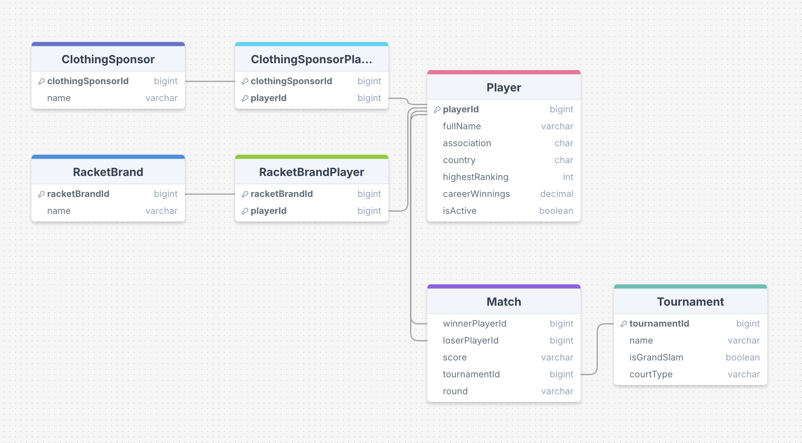

# Tennis Database

My database models data about professional tennis players and information like their match history and sponsors. All of the test data in the database is real, but is by no means comprehensive.

## Database Schema



## Query I thought it did well on

**Question**: Which clothing brand sponsors the most players?

**GPT SQL Response**:

```sql
SELECT cs.sponsorName, COUNT(csp.playerId) AS playerCount
FROM ClothingSponsor cs
JOIN ClothingSponsorPlayer csp ON cs.clothingSponsorId = csp.clothingSponsorId
GROUP BY cs.sponsorName
ORDER BY playerCount DESC
LIMIT 1;
```

**Friendly Response**: The clothing brand that sponsors the most players is Nike, with 7 players.

## Question that it tripped up on (multi-shot)

**Question**: What happened to Madison Keys at the 2025 Australian Open?

It made a pretty good SQL query that pretty much got all of the data needed to correctly answer this question. The returned rows had all of the necessary information and shows that the winning player ID in both rows corresponds with Madison Keys' ID. However, it really struggled to interpret the returned data correctly in both single shot and multi shot strategies. I think it's particularly funny that the friendly response says that she lost in the semifinal and then proceeded to win in the final.

**GPT SQL Response (multi-shot strategy)**:

```sql
SELECT * FROM Match
WHERE (winningPlayerId IN
    (SELECT playerId FROM Player WHERE fullName = 'Madison Keys')
OR losingPlayerId IN
    (SELECT playerId FROM Player WHERE fullName = 'Madison Keys'))
AND tournamentId =
    (SELECT tournamentId FROM Tournament WHERE tournamentName = 'Australian Open' AND tournamentYear = 2025);
```

SQL Result is: [(9, 6, '5-7 6-1 7-6(8)', 3, 'SF', 2025), (9, 7, '6-3 2-6 7-5', 3, 'F', 2025)]. Madison Keys' ID is 9, and the first column returned indicates the winning player of the match correctly.

**Friendly response**: In the 2025 Australian Open, Madison Keys reached the semifinals but lost in a close match with a score of 5-7, 6-1, 7-6(8). She then played in the final, winning against her opponent with a score of 6-3, 2-6, 7-5.

A more proper response obviously would have indicated that Madison Keys won both matches. It would also ideally tell me who her opponents were in those matches.

## Single Shot

The single shot prompting strategy resulted in worse results than the multi-shot on the above question. It generated a similar query, but it failed to return data regarding who actually won the matches. I wonder if the multi-shot strategy helped ChatGPT understand a bit more about the relationship between players and IDs and the necessity of returning IDs in the query for context.

**Question (single shot)**: Will we have a problem texting any of the previous award winners?

SQL Result is just match data with no indication of winner or loser: [('SF', '5-7 6-1 7-6(8)'), ('F', '6-3 2-6 7-5')]

**Friendly response**: At the 2025 Australian Open, Madison Keys made it to the semifinals, where she lost with a score of 5-7, 6-1, 7-6(8). She then reached the final but was defeated with a score of 6-3, 2-6, 7-5.

The returned query didn't have anything indicating who won or lost, so the friendly response just guessed or hallucinated what the results were. The multi-shot strategy at least returned more data for better context, so I would say it did better than single shot

## Conclusion

Overall I think that ChatGPT is good at generating queries that are nearly correct based on a natural language question. However, I think the majority of the queries or the returned friendly interpretation were incorrect in one way or another. It seems like ChatGPT has a difficult time contextualizing the data despite best attempts to familiarize it by giving it examples and information about the database schema.
